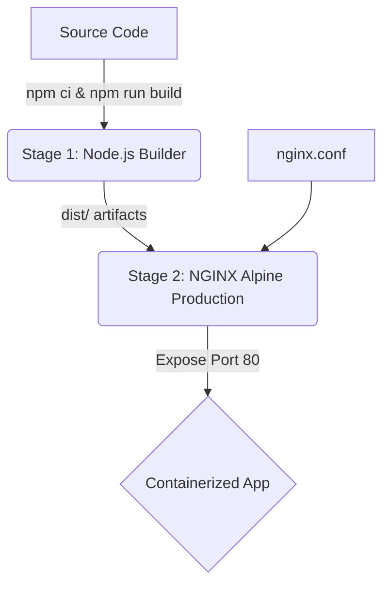

# Lalit Punjabi - DevOps Engineer Portfolio

[](https://github.com/lalitpunjabi/Portfolio_LalitPunjabi/actions/workflows/ci.yml)
[](https://github.com/lalitpunjabi/Portfolio_LalitPunjabi/actions/workflows/security.yml)
[](https://github.com/lalitpunjabi/Portfolio_LalitPunjabi/actions/workflows/docker-publish.yml)
[](https://github.com/lalitpunjabi/Portfolio_LalitPunjabi/actions/workflows/cd-aws.yml)
[](https://github.com/lalitpunjabi/Portfolio_LalitPunjabi/actions/workflows/cd-k8s.yml)

A premium, high-performance developer portfolio built with React, Vite, and completely custom Cyber-Midnight CSS. Designed specifically to showcase enterprise-grade DevSecOps expertise, robust CI/CD automation, containerization workflows, and cloud infrastructure deployments.

## 🚀 Features

*   **Vibrant Cyber-Midnight Aesthetic**: A totally custom, ultra-premium dark mode featuring deep cosmic backgrounds (`#02040a`), pulsing neon auras, and ambient mesh gradients to create a distinct, modern tech feel.
*   **Responsive Bento Grid & Terminal UI**: Utilizes modern Bento Grid layouts for skills and Mac/Linux terminal window aesthetics for project cards, maximizing readability and developer appeal.
*   **Dynamic Interactive Components**: 
    *   Custom floating terminal typing effect in the Hero section.
    *   Glassmorphism cards (`backdrop-blur-xl`) with high-saturation gradient hover states.
    *   Interactive 'Get In Touch' simulated macOS terminal form.
*   **Enterprise Containerization**: Fully Dockerized production environment utilizing multi-stage builds and an optimized NGINX alpine server.
*   **SEO & Performance Optimized**: Built on Vite for lightning-fast HMR and minimal bundle sizes, served via Gzip-compressed NGINX.

## 🛠️ Tech Stack & DevOps Tools

*   **Frontend Framework**: React 18 (with React DOM)
*   **Build Tool & Bundler**: Vite (Lightning-fast HMR and optimized builds)
*   **Language**: TypeScript (Strong typing for robust development)
*   **Styling**: Pure CSS3 (Custom Variables, Flexbox/Grid, Glassmorphism, Advanced Animations)
*   **Containerization**: Docker & Docker Compose (Multi-stage builds, Alpine base images)
*   **Web Server**: NGINX (Configured for SPA routing, Gzip, Security Headers, and aggressive caching)
*   **CI/CD Automation**: GitHub Actions (For automated build, validation, and deployment pipelines)
*   **Cloud Infrastructure**: AWS S3 & CloudFront / AWS EC2

---

## 🐳 Docker Architecture & Workflow

This project utilizes a highly optimized, production-ready multi-stage Docker build process to ensure the smallest possible attack surface and image size.



### 🛡️ Production Best Practices Implemented
*   **Multi-stage Builds**: Separates the build environment (Node.js) from the runtime environment (NGINX), discarding unnecessary source files and `node_modules` in the final image.
*   **Optimized Layer Caching**: `package.json` is copied and installed before source code to maximize Docker cache utilization.
*   **Minimal Base Images**: Utilizes `alpine` Linux variants to keep the image footprint drastically small and secure.
*   **Security Hardening**: NGINX is configured to serve strict security headers (`X-Frame-Options`, `X-XSS-Protection`, etc.).
*   **SPA Support**: NGINX is explicitly configured with `try_files` to natively support React Router's client-side routing.
*   **Healthchecks**: Built-in container health checks ensure orchestration tools can monitor the application state.

---

## 🔄 Enterprise DevSecOps CI/CD Pipeline

This project features a fully automated, production-grade GitHub Actions CI/CD architecture designed to ensure code quality, security, and seamless deployments.

*   **Continuous Integration (`ci.yml`)**: 
    *   Runs parallel Matrix Testing on Node.js 18 and 20.
    *   Enforces strict TypeScript type-checking and dependency integrity checks.
    *   Verifies production builds and securely passes artifacts downstream.
*   **DevSecOps Scanning (`security.yml`)**: 
    *   Runs Aqua Security's **Trivy** to scan Docker images and local filesystems.
    *   Automatically blocks deployments if `HIGH` or `CRITICAL` vulnerabilities or exposed secrets are detected.
*   **Docker Image Automation (`docker-publish.yml`)**: 
    *   Automatically builds and publishes the optimized Docker image to the GitHub Container Registry (GHCR).
    *   Implements multi-tagging (`latest`, short SHA, and semantic versions).
*   **Environment-Based Deployments (`cd-aws.yml`)**: 
    *   Deploys artifacts to AWS S3 using strict GitHub Environments (`production`) for manual approval gating.
    *   Automatically invalidates the AWS CloudFront cache.
*   **Release Automation (`release.yml`)**: 
    *   Automatically generates GitHub Releases and rich changelogs based on semantic tags.
*   **Kubernetes Automation (`cd-k8s.yml`)**:
    *   Dynamically injects the new image SHA into K8s manifests and validates structural integrity before live cluster rollouts.

---

## ☸️ Enterprise Kubernetes Orchestration

The application is engineered to run seamlessly on production Kubernetes clusters (e.g., AWS EKS, Minikube). The `k8s/` directory contains standard Kubernetes manifests implementing cloud-native best practices.

### 🏗️ Cluster Architecture
*   **Deployment (`deployment.yaml`)**: Uses a **RollingUpdate** strategy (`maxSurge: 1`, `maxUnavailable: 0`) for true zero-downtime deployments. Configures strict CPU/Memory resource boundaries and runs unprivileged security contexts.
*   **Health Probes**: Explicit `livenessProbe` and `readinessProbe` HTTP checks ensure the NGINX container is ready before the Service load balancer routes traffic to it.
*   **Service (`service.yaml`)**: Internal `ClusterIP` exposing port 80.
*   **Ingress (`ingress.yaml`)**: NGINX Ingress Controller routing configuration to safely expose the internal Service to the public web (HTTPS/TLS ready).
*   **Auto-Scaling (`hpa.yaml`)**: A Horizontal Pod Autoscaler dynamically scales replicas from 2 to 5 based on CPU utilization crossing 70%.
*   **Config & Secrets**: Separates configuration (`configmap.yaml`) and sensitive data (`secrets.yaml`) from the application code following 12-factor app methodologies.

### 🚀 Deploying to Kubernetes

**1. Apply Configuration and Secrets:**
```bash
kubectl apply -f k8s/configmap.yaml
kubectl apply -f k8s/secrets.yaml
```

**2. Deploy the Application Stack:**
```bash
kubectl apply -f k8s/deployment.yaml
kubectl apply -f k8s/service.yaml
kubectl apply -f k8s/ingress.yaml
kubectl apply -f k8s/hpa.yaml
```

**3. Verify Zero-Downtime Rollout:**
```bash
kubectl rollout status deployment/portfolio-ui
kubectl get pods -l app=portfolio-ui
```

---

## 💻 Local Development & Docker Setup

### Option A: Using Docker Compose (Recommended)

1.  **Clone the repository:**
    ```bash
    git clone https://github.com/lalitpunjabi/portfolio.git
    cd portfolio
    ```

2.  **Spin up the containerized environment:**
    ```bash
    docker-compose up --build -d
    ```
    *The application will now be running at `http://localhost:8080`.*

3.  **To stop the container:**
    ```bash
    docker-compose down
    ```

### Option B: Standard Node.js Development

1.  **Install dependencies and start dev server:**
    ```bash
    npm install
    npm run dev
    ```
    *Available at `http://localhost:5173`.*

---

## 🚀 Production Deployment Steps

### Deploying to AWS EC2 via Docker

This guide explains how to deploy the containerized application to an AWS EC2 Linux instance.

1.  **Provision an EC2 Instance:** Launch an Ubuntu or Amazon Linux 2 instance and open port `80` and `8080` in the Security Group.
2.  **Install Docker & Git on EC2:**
    ```bash
    sudo apt update
    sudo apt install docker.io docker-compose git -y
    sudo systemctl enable --now docker
    ```
3.  **Clone and Run:**
    ```bash
    git clone https://github.com/lalitpunjabi/portfolio.git
    cd portfolio
    sudo docker-compose up --build -d
    ```

### Alternative: AWS S3 + CloudFront (Serverless)

This portfolio is also built to be deployed using a highly scalable, serverless AWS architecture.

1.  **Build:** `npm run build`
2.  **Upload to S3:** Upload the `dist/` folder to a private S3 bucket.
3.  **Configure CloudFront:** Create a CDN pointing to the S3 bucket, enable **Origin Access Control (OAC)**, and set error pages (403/404) to redirect to `/index.html`.

---

## 🔧 Docker Troubleshooting

*   **Port Conflicts:** If `docker-compose up` fails, ensure port `8080` isn't in use. Modify the `ports` mapping in `docker-compose.yml` (e.g., `"8081:80"`) if necessary.
*   **Routing Issues (404s on refresh):** If you experience 404s when manually refreshing a page, ensure the custom `nginx.conf` is properly mounting inside the container. This is handled by default via `COPY nginx/nginx.conf /etc/nginx/conf.d/default.conf` in the Dockerfile.
*   **Stale Changes:** If recent code changes aren't reflecting, force a clean build without cache:
    ```bash
    docker-compose build --no-cache
    docker-compose up -d
    ```

## 📝 License

Designed and developed for Lalit Punjabi.
