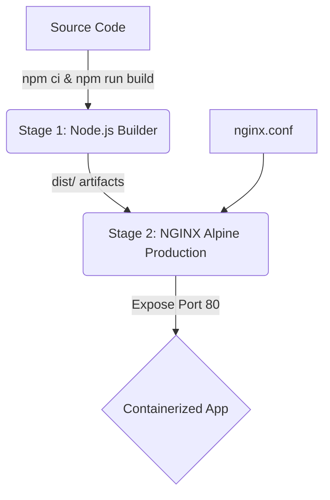

# Lalit Punjabi - DevOps Engineer Portfolio

[](https://github.com/lalitpunjabi/Portfolio_LalitPunjabi/actions/workflows/ci.yml)
[](https://github.com/lalitpunjabi/Portfolio_LalitPunjabi/actions/workflows/security.yml)
[](https://github.com/lalitpunjabi/Portfolio_LalitPunjabi/actions/workflows/docker-publish.yml)
[](https://github.com/lalitpunjabi/Portfolio_LalitPunjabi/actions/workflows/cd-vps.yml)
[](https://github.com/lalitpunjabi/Portfolio_LalitPunjabi/actions/workflows/cd-k8s.yml)

A premium, high-performance developer portfolio built with React, Vite, and completely custom Cyber-Midnight CSS. Designed specifically to showcase enterprise-grade DevSecOps expertise, robust CI/CD automation, containerization workflows, and cloud infrastructure deployments.

## 🚀 Features

*   **Recruiter vs. Developer View Toggle**: Instantly switch between a streamlined 30-second recruiter overview and an in-depth technical developer mode with live interactive CI/CD lab simulations.
*   **Flagship Production Case Studies**:
    *   **DEPLOYMATE**: Intelligent Enterprise CI/CD, GitOps & AIOps Platform (Jenkins, Docker, Kubernetes, Prometheus, Grafana, Trivy).
    *   **BloodMate**: Real-Time Emergency Blood Connect System (React, Vite, FastAPI, PostgreSQL, AWS RDS, AWS EC2, NGINX).
    *   **AWS Infrastructure Automation**: Production Multi-AZ VPC, EKS & RDS Terraform automation.
*   **Vibrant Cyber-Midnight Aesthetic**: A custom, ultra-premium dark theme with cosmic backgrounds (`#0b0f19`), pulsing neon accents, and ambient mesh gradients.
*   **DevOps Engineering Proof of Work**: Features an Engineering Capability Snapshot, interactive terminal visualizers, and a signature "This Portfolio is a DevOps Project" infrastructure guide.
*   **Enterprise Containerization**: Fully Dockerized production environment utilizing multi-stage builds and an optimized NGINX alpine server.
*   **SEO & Performance Optimized**: Built on Vite for lightning-fast HMR and minimal bundle sizes, served via Gzip-compressed NGINX.


## 🛠️ Tech Stack & DevOps Tools

*   **Frontend Framework**: React 18 (with React DOM)
*   **Build Tool & Bundler**: Vite (Lightning-fast HMR and optimized builds)
*   **Language**: TypeScript (Strong typing for robust development)
*   **Styling**: Pure CSS3 (Custom Variables, Flexbox/Grid, Glassmorphism, Advanced Animations)
*   **Containerization**: Docker & Docker Compose (Multi-stage builds, Alpine base images)
*   **Web Server**: NGINX (Configured for SPA routing, Gzip, Security Headers, and aggressive caching)
*   **CI/CD Automation**: GitHub Actions (For automated build, validation, and deployment pipelines)
*   **Cloud Infrastructure & Hosting**: AWS EC2 (Docker + NGINX Reverse Proxy + Certbot SSL on `app.devlalit.space`) / AWS S3 & CloudFront

---

## 🐳 Docker Architecture & Workflow

This project utilizes a highly optimized, production-ready multi-stage Docker build process to ensure the smallest possible attack surface and image size.


```mermaid
graph TD
    A[Source Code] -->|npm ci & npm run build| B(Stage 1: Node.js Builder)
    B -->|dist/ artifacts| C(Stage 2: NGINX Alpine Production)
    D[nginx.conf] --> C
    C -->|Expose Port 80| E{Containerized App}
```

### 🛡️ Production Best Practices Implemented
*   **Multi-stage Builds**: Separates the build environment (Node.js) from the runtime environment (NGINX), discarding unnecessary source files and `node_modules` in the final image.
*   **Optimized Layer Caching**: `package.json` is copied and installed before source code to maximize Docker cache utilization.
*   **Minimal Base Images**: Utilizes `alpine` Linux variants to keep the image footprint drastically small and secure.
*   **Security Hardening**: NGINX is configured to serve strict security headers (`X-Frame-Options`, `X-XSS-Protection`, etc.).
*   **SPA Support**: NGINX is explicitly configured with `try_files` to natively support React Router's client-side routing.
*   **Healthchecks**: Built-in container health checks ensure orchestration tools can monitor the application state.

---

## 🔄 Enterprise DevSecOps CI/CD Pipeline

This project features a fully automated, production-grade GitHub Actions CI/CD architecture designed to ensure code quality, supply-chain security, and zero-downtime deployments.

*   **Continuous Integration (`ci.yml`)**: 
    *   Enforces strict TypeScript type-checking (`tsc --noEmit`), ESLint code quality rules, and Vitest component testing.
    *   Verifies production bundle generation with deterministic `npm ci` lockfile installation.
*   **DevSecOps Scanning (`security.yml`)**: 
    *   Runs Aqua Security's **Trivy** scanner on Docker images and local filesystems.
    *   Blocks deployments on `HIGH` or `CRITICAL` vulnerabilities or exposed secrets.
*   **Docker Automation & Supply-Chain Attestation (`docker-publish.yml`)**: 
    *   Builds and pushes unprivileged OCI-compliant Docker images to GitHub Container Registry (GHCR).
    *   Generates automated **Software Bill of Materials (SBOM)** and **SLSA Build Provenance** attestations (`sbom: true`, `provenance: mode=max`).
    *   Implements immutable SHA tagging (`sha-<short-sha>`).
*   **AWS EC2 Continuous Deployment (`cd-vps.yml`)**: 
    *   Triggered on `main` branch push following successful Docker build.
    *   Authenticates via **AWS OIDC** (`id-token: write`, `environment: Production`) and SSH key (`VPS_HOST`, `VPS_SSH_KEY`).
    *   Deploys using **Zero-Downtime Blue/Green Promotion** with host NGINX syntax validation (`sudo nginx -t`) and automatic rollback.
*   **Optional S3 Static Demo (`cd-aws.yml`)**: 
    *   Optional `workflow_dispatch` pipeline for static S3 bucket deployment.
*   **Optional K8s Manifest Validation (`cd-k8s.yml`)**:
    *   Optional `workflow_dispatch` workflow for Kubernetes manifest validation using `kubeconform`.

---

## ☸️ Enterprise Kubernetes Orchestration

The application is engineered to run seamlessly on production Kubernetes clusters (e.g., AWS EKS, Minikube). The `k8s/` directory contains standard Kubernetes manifests implementing cloud-native best practices.

### 🏗️ Cluster Architecture
*   **Deployment (`deployment.yaml`)**: Uses a **RollingUpdate** strategy (`maxSurge: 1`, `maxUnavailable: 0`) for true zero-downtime deployments. Configures strict CPU/Memory resource boundaries and runs unprivileged security contexts.
*   **Health Probes**: Explicit `livenessProbe` and `readinessProbe` HTTP checks ensure the NGINX container is ready before the Service load balancer routes traffic to it.
*   **Service (`service.yaml`)**: Internal `ClusterIP` exposing port 80.
*   **Ingress (`ingress.yaml`)**: NGINX Ingress Controller routing configuration to safely expose the internal Service to the public web (HTTPS/TLS ready).
*   **Auto-Scaling (`hpa.yaml`)**: A Horizontal Pod Autoscaler dynamically scales replicas from 2 to 5 based on CPU utilization crossing 70%.
*   **Config & Secrets**: Separates configuration (`configmap.yaml`) and sensitive data (`secrets.yaml`) from the application code following 12-factor app methodologies.

### 🚀 Deploying to Kubernetes

**1. Apply Configuration and Secrets:**
```bash
kubectl apply -f k8s/configmap.yaml
kubectl apply -f k8s/secrets.yaml
```

**2. Deploy the Application Stack:**
```bash
kubectl apply -f k8s/deployment.yaml
kubectl apply -f k8s/service.yaml
kubectl apply -f k8s/ingress.yaml
kubectl apply -f k8s/hpa.yaml
```

**3. Verify Zero-Downtime Rollout:**
```bash
kubectl rollout status deployment/portfolio-ui
kubectl get pods -l app=portfolio-ui
```

---

## 💻 Local Development & Engineering Tooling

### System Requirements
* **Node.js**: `v20.x` or higher
* **npm**: `v10.x` or higher

### 1. Installation & Environment Configuration
```bash
# Clone the repository
git clone https://github.com/lalitpunjabi/Portfolio_LalitPunjabi.git
cd Portfolio_LalitPunjabi

# Install dependencies
npm install

# Configure environment variables (optional for contact form)
cp .env.example .env
```

### 2. Available Development Commands

| Command | Action |
| :--- | :--- |
| `npm run dev` | Start local Vite development server at `http://localhost:5173` |
| `npm run typecheck` | Run strict TypeScript type check (`tsc --noEmit`) |
| `npm run lint` | Run ESLint across `.ts`, `.tsx`, `.js`, `.jsx` files |
| `npm run test` | Run unit & component test suite via Vitest |
| `npm run test:coverage` | Run Vitest test coverage report |
| `npm run build` | Compile TypeScript & generate production build bundle in `dist/` |
| `npm run preview` | Preview production build locally |

### 3. Project Structure
```text
Portfolio_LalitPunjabi/
├── src/
│   ├── components/        # UI section components & ErrorBoundary
│   │   └── __tests__/     # Component unit & integration tests
│   ├── config/            # External service configurations (EmailJS)
│   ├── data/              # Portfolio content data (projects, skills, certs)
│   ├── hooks/             # Custom React hooks & animation utilities
│   │   └── __tests__/     # Hook test suites
│   ├── test/              # Test environment setup
│   ├── App.tsx            # Main application layout
│   └── main.tsx           # Application entry point with ErrorBoundary
├── public/                # Static assets, robots.txt, sitemap.xml
├── eslint.config.js       # ESLint flat configuration for TypeScript
├── vite.config.ts         # Vite build & Vitest test configuration
└── tsconfig.json          # Strict TypeScript compiler options
```

### 4. Option B: Using Docker Compose
```bash
docker-compose up --build -d
```
*Application available at `http://localhost:8080`.*

---

## 🚀 Production Deployment Steps

### 🔄 Active Production Deployment Architecture

The production application is deployed on **AWS EC2** using containerized unprivileged NGINX proxied by Host NGINX with Certbot TLS (`https://app.devlalit.space`).

> [!IMPORTANT]
> **Production Architecture Disclaimer**: S3 and CloudFront are **NOT** used for active production hosting. The live application relies on GitHub Actions → GHCR → SSH → AWS EC2 → Host NGINX → Docker Container.

```text
GitHub (main branch)
   ↓
GitHub Actions (OIDC Auth + SSH Deployment)
   ↓
GHCR (ghcr.io/lalitpunjabi/portfolio_lalitpunjabi:sha-<short-sha>)
   ↓
SSH (appleboy/ssh-action via VPS_HOST / VPS_SSH_KEY)
   ↓
AWS EC2 Host
   ↓
Host NGINX (Reverse Proxy & Certbot TLS on https://app.devlalit.space)
   ↓
Docker Container (Unprivileged NGINX :8080 [Blue] or :8081 [Green])
```

---

## 🔐 GitHub Actions & AWS Security Configuration

### 1. AWS IAM Role Trust Policy (OIDC)
Create an IAM Role with OIDC Federated Authentication. The Trust Policy must be strictly restricted to the repository and `Production` GitHub Environment:

```json
{
  "Version": "2012-10-17",
  "Statement": [
    {
      "Effect": "Allow",
      "Principal": {
        "Federated": "arn:aws:iam::YOUR_AWS_ACCOUNT_ID:oidc-provider/token.actions.githubusercontent.com"
      },
      "Action": "sts:AssumeRoleWithWebIdentity",
      "Condition": {
        "StringEquals": {
          "token.actions.githubusercontent.com:aud": "sts.amazonaws.com",
          "token.actions.githubusercontent.com:sub": "repo:lalitpunjabi/Portfolio_LalitPunjabi:environment:Production"
        }
      }
    }
  ]
}
```

### 2. GitHub Production Environment Configuration
In GitHub Repository $\rightarrow$ **Settings** $\rightarrow$ **Environments** $\rightarrow$ **`Production`**:

#### Secrets (`Production` Environment Secrets)
* `AWS_ROLE_ARN`: AWS IAM Role ARN for OIDC (`arn:aws:iam::YOUR_AWS_ACCOUNT_ID:role/GitHubActions-Portfolio-Production`)
* `VPS_HOST`: AWS EC2 Public / Elastic IP address
* `VPS_USERNAME`: `ubuntu` (or dedicated SSH deployment user)
* `VPS_SSH_KEY`: OpenSSH private key with access to EC2 instance

#### Variables (`Production` Environment Variables)
* `AWS_REGION`: `ap-south-1`
* `VPS_PORT`: `22`

---

## 🚀 Production Blue/Green Deployment & Automatic Rollback

The production deployment script (`.github/workflows/cd-vps.yml` & `scripts/deploy-production.sh`) implements zero-downtime blue/green deployment:

1. **Pre-flight Checks**: Validates Docker daemon, host NGINX status, and curl tools.
2. **Pull & Digest Resolution**: Pulls `ghcr.io/lalitpunjabi/portfolio_lalitpunjabi:sha-<commit-sha>` and inspects the exact `sha256:` digest before altering running state.
3. **Candidate Container Launch**: Starts candidate container on candidate port (`:8081` if active is `:8080`, or `:8080` if active is `:8081`).
4. **Health Check & HTTP Smoke Test**: Polls `docker inspect` health status and checks local HTTP endpoint (`http://127.0.0.1:<candidate-port>/`).
5. **Host NGINX Switch**: Backs up NGINX config, updates `proxy_pass` to candidate port, validates config via `sudo nginx -t`, and reloads NGINX (`sudo systemctl reload nginx`).
6. **Public Endpoint Check**: Verifies `https://app.devlalit.space` HTTP 200 response.
7. **Decommission Old Container**: Stops and removes old container only after candidate is 100% verified.

### Automatic Rollback
If any step fails (image pull, health check, HTTP smoke test, `nginx -t`, reload, public endpoint check):
* Candidate container is automatically stopped and removed.
* Host NGINX site configuration is restored from backup (`.bak`).
* `sudo nginx -t && sudo systemctl reload nginx` is executed.
* Active container health is verified.
* Deployment exits with status 1 without breaking live site traffic.

### Manual Rollback Command
To manually initiate a rollback on EC2, run:
```bash
bash scripts/rollback-production.sh
```

---

## 🛠️ Disaster Recovery Runbook

### Scenario A: Docker Container Failure
* **Detection**: Container healthcheck fails or HTTP 502 Bad Gateway observed on `https://app.devlalit.space`.
* **Immediate Action**: Run `bash scripts/production-health-check.sh` on EC2 host to diagnose active slot.
* **Recovery Command**:
  ```bash
  # Restart the failed active container
  docker restart portfolio-ui-blue  # or portfolio-ui-green
  ```
* **Validation**: Run `curl -i http://127.0.0.1:8080/health` or `http://127.0.0.1:8081/health`.

### Scenario B: Failed Production Deployment
* **Detection**: GitHub Actions workflow fails during candidate launch, NGINX test, or public verification.
* **Immediate Action**: Workflow automatically triggers `rollback()` logic. No live traffic interruption occurs.
* **Recovery Command**:
  ```bash
  # If manual recovery required on EC2:
  bash scripts/rollback-production.sh
  ```
* **Validation**: Verify live application via `curl -I https://app.devlalit.space/`.

### Scenario C: EC2 Reboot / Host Restart
* **Detection**: EC2 host rebooted due to kernel updates or AWS maintenance.
* **Immediate Action**: Docker daemon starts automatically (`systemctl enable docker`). Active container auto-restarts via `--restart unless-stopped`.
* **Recovery Command**:
  ```bash
  sudo systemctl restart docker nginx
  ```
* **Validation**: Confirm NGINX and Docker processes: `sudo systemctl status docker nginx`.

### Scenario D: EC2 Docker Service Failure
* **Detection**: `docker ps` returns connection error: `Cannot connect to the Docker daemon`.
* **Immediate Action**: Check systemd service status.
* **Recovery Command**:
  ```bash
  sudo systemctl status docker
  sudo systemctl restart docker
  ```
* **Validation**: Run `docker ps` to list active containers.

### Scenario E: Corrupted Deployment State File
* **Detection**: Deployment script fails to detect active slot or `/opt/portfolio/deployment-state.json` is malformed.
* **Immediate Action**: Manually inspect active container via `docker ps`.
* **Recovery Command**:
  ```bash
  # Re-create deployment state file manually
  echo '{"active_slot":"blue","active_port":"8080"}' | sudo tee /opt/portfolio/deployment-state.json
  ```
* **Validation**: Run `bash scripts/production-health-check.sh`.

### Scenario F: Complete EC2 Instance Replacement
* **Detection**: EC2 instance terminated or unrecoverable system failure.
* **Immediate Action**: Provision new EC2 Ubuntu 24.04 instance, re-attach Elastic IP.
* **Recovery Command**:
  ```bash
  # 1. Install prerequisites
  sudo apt update && sudo apt install -y docker.io nginx certbot python3-certbot-nginx
  sudo systemctl enable --now docker nginx
  sudo usermod -aG docker ubuntu
  
  # 2. Configure NGINX reverse proxy & TLS
  sudo certbot --nginx -d app.devlalit.space
  
  # 3. Pull latest immutable image tag from GHCR
  docker pull ghcr.io/lalitpunjabi/portfolio_lalitpunjabi:latest
  docker run -d --name portfolio-ui-blue --restart unless-stopped -p 8080:8080 ghcr.io/lalitpunjabi/portfolio_lalitpunjabi:latest
  ```
* **Validation**: Access `https://app.devlalit.space/` in browser.

### Scenario G: GHCR Registry Temporary Unavailability
* **Detection**: `docker pull ghcr.io/...` fails during deployment with HTTP 503/504 or network timeout.
* **Immediate Action**: Deployment workflow catches image pull failure and aborts *before* altering running containers.
* **Recovery Command**: Active container remains 100% online. Re-trigger workflow once GHCR status is operational.
* **Validation**: Check GitHub Status / GHCR service availability.

---

## 📊 Operations & Observability Guide

### Docker Daemon Log Rotation Policy (`/etc/docker/daemon.json`)
To prevent container log files from consuming host disk space, configure Docker daemon log limits on EC2:

```json
{
  "log-driver": "json-file",
  "log-opts": {
    "max-size": "10m",
    "max-file": "3"
  }
}
```
Apply via: `sudo systemctl reload docker`.

### Operational Commands Reference

| Purpose | Safe Command |
| :--- | :--- |
| **System Diagnostic** | `bash scripts/production-health-check.sh` |
| **Manual Rollback** | `bash scripts/rollback-production.sh` |
| **Inspect Active Container** | `docker ps --format 'table {{.Names}}\t{{.Status}}\t{{.Ports}}'` |
| **Container Traceability** | `docker inspect --format='{{index .Config.Labels "org.opencontainers.image.title"}}' portfolio-ui-blue` |
| **Host NGINX Test** | `sudo nginx -t` |
| **Host NGINX Reload** | `sudo systemctl reload nginx` |
| **Safe Image Pruning** | `docker image prune -f` *(Preserves active & tagged images)* |

---

## 💻 Local Development & Engineering Tooling

---

## 🔧 Docker Troubleshooting

*   **Port Conflicts:** If `docker-compose up` fails, ensure port `8080` isn't in use. Modify the `ports` mapping in `docker-compose.yml` (e.g., `"8081:80"`) if necessary.
*   **Routing Issues (404s on refresh):** If you experience 404s when manually refreshing a page, ensure the custom `nginx.conf` is properly mounting inside the container. This is handled by default via `COPY nginx/nginx.conf /etc/nginx/conf.d/default.conf` in the Dockerfile.
*   **Stale Changes:** If recent code changes aren't reflecting, force a clean build without cache:
    ```bash
    docker-compose build --no-cache
    docker-compose up -d
    ```

## 📝 License

Designed and developed for Lalit Punjabi.
